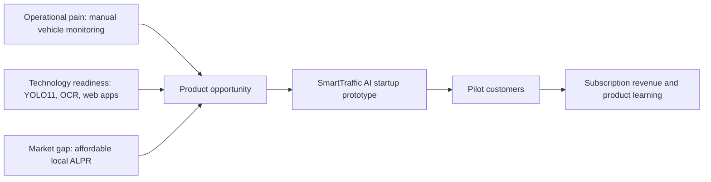
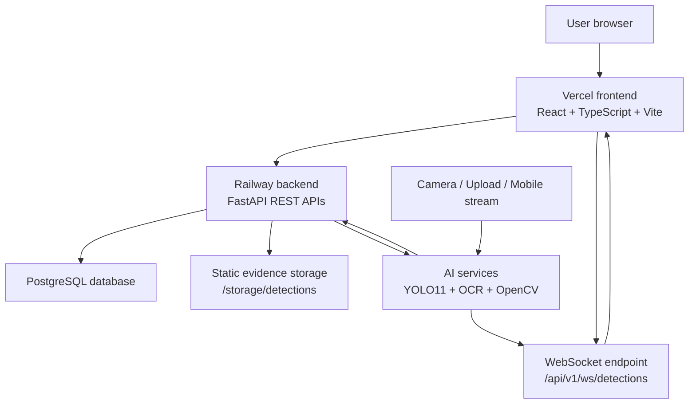
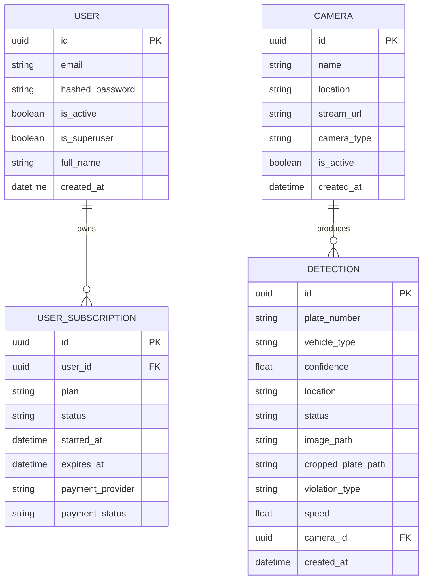
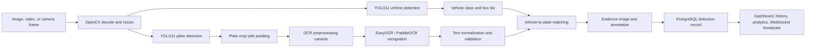
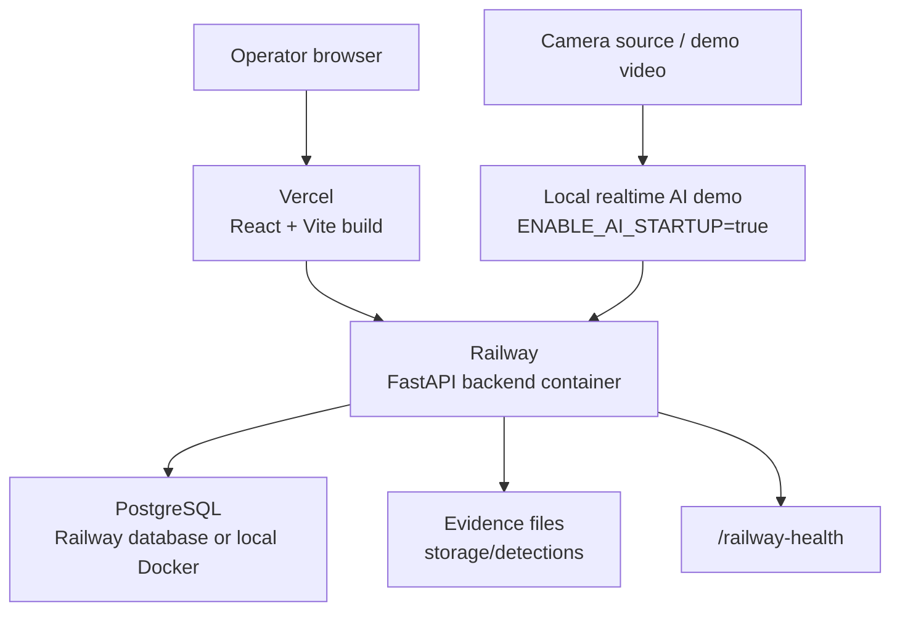

# Building a Real-Time Vehicle Monitoring and License Plate Recognition System

**Graduation Thesis Report - Entrepreneurship and Innovation Orientation**

| Item | Information |
| --- | --- |
| Project name | SmartTraffic AI |
| Thesis topic | Building a Real-Time Vehicle Monitoring and License Plate Recognition System |
| Authors | Nguyen Tan My; Ly Trung Nam |
| Supervisor | MSc. Nguyen Do Cong Phap |
| Main orientation | Entrepreneurship, innovation, applied AI, and smart traffic management |
| Implementation stack | React + TypeScript + Vite, FastAPI, PostgreSQL, YOLO11, EasyOCR/PaddleOCR, WebSockets, Railway, Vercel |

## Abstract

SmartTraffic AI is a full-stack product prototype designed to support real-time vehicle monitoring and automatic license plate recognition. The system combines computer vision, deep learning, optical character recognition, web technologies, and a subscription-oriented business model to address practical traffic, parking, and security management problems. The technical solution uses trained YOLO11 models for vehicle detection and license plate localization, EasyOCR/PaddleOCR for plate text recognition, FastAPI for backend services, PostgreSQL for persistent storage, WebSockets for real-time updates, and a React + TypeScript + Vite frontend for user interaction. The deployed prototype uses Railway for backend deployment and Vercel for frontend deployment.

The project is developed not only as a technical demonstration but also as an entrepreneurship and innovation thesis. Therefore, the report analyzes market needs, customer pain points, competitor positioning, commercialization potential, financial assumptions, and a Business Model Canvas. The solution targets universities, parking lots, residential areas, enterprises, and smart city projects that need affordable, evidence-based, and scalable vehicle monitoring. The current prototype demonstrates core workflows including dashboard monitoring, image/video detection, detection history, analytics, camera management, and subscription activation. Future work focuses on a dedicated Vietnam license plate OCR model, improved night-time recognition, multi-camera monitoring, vehicle tracking, and GPU deployment.

## Keywords

Smart traffic, vehicle monitoring, automatic license plate recognition, YOLO11, OCR, FastAPI, React, PostgreSQL, WebSockets, startup prototype, smart city.

## List of Figures

| Figure | Caption |
| --- | --- |
| Figure 2.1 | Opportunity logic for SmartTraffic AI |
| Figure 3.1 | Overall system architecture |
| Figure 3.2 | AI processing pipeline |
| Figure 3.3 | Database relationship diagram |
| Figure 3.4 | Deployment architecture |
| Figure 4.1 | SmartTraffic AI dashboard interface |
| Figure 4.2 | Dark dashboard demonstration |
| Figure 4.3 | Login interface for authenticated access |

## List of Tables

| Table | Description |
| --- | --- |
| Table 1.1 | Project objectives |
| Table 1.2 | Project scope |
| Table 2.1 | Industry and technology trends |
| Table 2.2 | Pain point analysis |
| Table 2.3 | Customer analysis |
| Table 2.4 | Competitor analysis |
| Table 3.1 | Main system components |
| Table 3.2 | Database entities |
| Table 3.3 | Backend API groups |
| Table 3.4 | Product feature summary |
| Table 4.1 | System evaluation summary |
| Table 4.2 | Business Model Canvas |
| Table 4.3 | Marketing plan using the 4P framework |
| Table 4.4 | Estimated monthly operating costs |
| Table 4.5 | Revenue and profit estimation |
| Table 4.6 | Commercialization target markets |
| Table 5.1 | Future work roadmap |

# Chapter 1. Introduction

## 1.1 Background and Motivation

Traffic monitoring is becoming an important part of digital transformation in cities, campuses, residential communities, and private enterprises. As the number of vehicles increases, traditional manual monitoring becomes less efficient, less consistent, and more expensive. Security guards and operators often need to observe multiple camera screens, record license plate numbers manually, search historical events from video footage, and prepare reports after incidents occur. These workflows consume time and are vulnerable to human error, especially during peak traffic hours or at night.

Automatic License Plate Recognition (ALPR) and vehicle monitoring technologies can reduce this operational burden by converting camera data into searchable digital records. A modern system can detect vehicles, locate license plates, recognize plate numbers, store evidence images, and provide dashboards for decision-making. In an entrepreneurship and innovation context, this creates a business opportunity: organizations that cannot afford expensive enterprise traffic systems still need practical tools for access control, parking management, incident investigation, and traffic analytics.

SmartTraffic AI is motivated by this gap between operational demand and affordable intelligent monitoring solutions. The project uses current full-stack web technologies and applied AI models to build a deployable product prototype. The system demonstrates how a startup-oriented solution can combine real-time monitoring, AI inference, evidence storage, analytics, and subscription packaging. Instead of being only a research experiment, SmartTraffic AI is designed as an early-stage software product that can be piloted with real customers, improved through feedback, and commercialized for selected market segments.

From a technical perspective, the project is also motivated by the rapid maturity of object detection models and web application frameworks. YOLO11-style detection models make it feasible to perform vehicle and license plate localization with practical latency. OCR engines such as EasyOCR and PaddleOCR can extract text from plate crops after image preprocessing. FastAPI provides a high-performance backend foundation, React + TypeScript + Vite supports a responsive frontend experience, PostgreSQL stores structured operational records, and WebSockets deliver live updates to the dashboard. The combination of these technologies supports a complete product workflow from camera input to business reporting.

## 1.2 Problem Statement

Many organizations currently rely on manual observation or basic CCTV systems for vehicle monitoring. These systems can record video but often cannot automatically transform traffic events into structured data. When an incident occurs, operators must manually review video, identify the vehicle, estimate the time, and write down plate numbers. This process is slow and difficult to scale when multiple entrances, exits, or parking zones are involved.

The main problem addressed by this thesis is how to design and build an affordable, real-time vehicle monitoring and license plate recognition system that can detect vehicles, recognize license plates, store evidence, visualize analytics, and support commercialization through a software product model. The system must be technically feasible with available infrastructure, understandable for non-technical operators, and suitable for early market validation.

The problem includes both technical and business dimensions. Technically, the system must integrate computer vision, OCR, backend APIs, database storage, and real-time frontend updates. It must handle image uploads, video sampling, camera streams, detection history, analytics, and evidence viewing. From a business perspective, the product must provide clear value to target customers, have a realistic cost structure, and support a pricing model that can be tested in pilot deployments.

## 1.3 Objectives

The general objective of the project is to build a full-stack smart traffic monitoring prototype that can recognize vehicles and license plates, manage detection records, and demonstrate commercial potential as a subscription-based product. The system is expected to serve as both a graduation thesis implementation and a startup prototype.

**Table 1.1. Project Objectives**

| Objective | Description | Expected outcome |
| --- | --- | --- |
| Build an AI detection pipeline | Use YOLO11 vehicle detection, YOLO11 plate detection, and OCR recognition to process images, videos, and camera frames. | Detected vehicles, localized license plates, recognized plate text, and structured result data. |
| Develop a backend platform | Implement FastAPI services for authentication, detection, history, analytics, subscriptions, WebSockets, and health checks. | A maintainable API layer that connects AI processing, storage, and frontend clients. |
| Design a frontend dashboard | Use React + TypeScript + Vite to build Dashboard, Detection, History, Analytics, Camera, and Subscription pages. | A professional operator interface for monitoring and product demonstration. |
| Store and manage evidence | Save detection records, original evidence images, annotated images, timestamps, vehicle type, confidence, and related metadata. | Searchable history suitable for review, reporting, and incident investigation. |
| Demonstrate real-time updates | Use WebSockets to broadcast new detections and camera stream outputs to connected clients. | Live dashboard behavior without manual refresh. |
| Validate startup potential | Analyze market need, customer segments, pricing, costs, Business Model Canvas, and commercialization channels. | Entrepreneurship-oriented thesis content and a practical business direction. |

## 1.4 Scope of the Project

The project scope is defined to balance technical depth and entrepreneurial feasibility. SmartTraffic AI is not intended to replace a nationwide traffic enforcement platform at the current stage. Instead, it is a working prototype for controlled environments such as universities, parking areas, residential gates, enterprise entrances, and smart city pilot points.

**Table 1.2. Project Scope**

| Scope area | Included in this project | Not included in the current version |
| --- | --- | --- |
| AI processing | YOLO11 vehicle detection, YOLO11 license plate detection, EasyOCR/PaddleOCR recognition, image preprocessing, evidence generation. | A fully dedicated Vietnam license plate OCR model trained on a large national dataset. |
| Input sources | Image upload, sampled video upload, local camera source, mobile camera WebSocket stream, configurable camera source. | Large-scale distributed camera ingestion across many physical sites. |
| Backend | FastAPI REST APIs, WebSocket endpoint, JWT authentication, PostgreSQL persistence, static evidence serving, health endpoints. | Advanced multi-tenant enterprise administration and full legal enforcement workflow. |
| Frontend | Dashboard, Detection, History, Analytics, Camera Management, Subscription, login and account-related pages. | Native mobile applications and offline desktop applications. |
| Deployment | Railway backend deployment, Railway/PostgreSQL database configuration, Vercel frontend deployment, Docker local development. | Production GPU cluster, edge device deployment, and high-availability multi-region architecture. |
| Business model | Subscription plans, demo MoMo payment flow, target market analysis, Business Model Canvas, marketing plan, financial estimate. | Legally binding payment settlement, tax processing, and audited financial statements. |

The current prototype focuses on proving the core product concept. It demonstrates that camera or upload data can be processed by AI, converted into evidence records, displayed in a modern dashboard, and packaged as a software service. The project also identifies limitations and future development directions required before a large-scale commercial release.

## 1.5 Contributions

This thesis contributes a practical integration of AI, web engineering, and startup design. The first contribution is a working AI pipeline that combines trained YOLO11 models for vehicle and plate detection with OCR engines for license plate text recognition. The pipeline performs image decoding, vehicle detection, plate detection, plate cropping, OCR preprocessing, text normalization, evidence generation, and result serialization.

The second contribution is a full-stack product implementation. The backend is built with FastAPI, SQLModel, PostgreSQL, WebSockets, and modular service layers. It exposes APIs for detection upload, video sampling, detection history, analytics, subscriptions, authentication, and health monitoring. The frontend uses React, TypeScript, Vite, TanStack Router, TanStack Query, Recharts, and reusable UI components to create an operator-facing dashboard. This creates a complete interaction loop from user input to AI result display.

The third contribution is an entrepreneurship-oriented product model. The project includes subscription plans, a demo payment flow, customer segmentation, pain point analysis, competitor analysis, marketing planning, financial assumptions, and commercialization strategy. This helps transform the technical prototype into a potential startup concept rather than a one-time academic demo.

The fourth contribution is a realistic evaluation of deployment constraints. The project recognizes that Railway and Vercel are suitable for API hosting, frontend delivery, and prototype validation, while continuous real-time AI inference benefits from local processing or future GPU deployment. This distinction improves the credibility of the system design and clarifies the roadmap for commercialization.

## 1.6 Thesis Structure

This report is organized into five chapters. Chapter 1 introduces the project background, problem statement, objectives, scope, contributions, and thesis structure. Chapter 2 reviews industry trends, market needs, customer problems, competitors, opportunities, and the theoretical background behind the technologies used in the system.

Chapter 3 presents the system design and product development process. It describes the overall architecture, database design, AI processing pipeline, frontend design, backend design, deployment architecture, and product features. Chapter 4 discusses deployment, demonstration, evaluation, Business Model Canvas, marketing plan, financial plan, and commercialization strategy. Chapter 5 concludes the thesis by summarizing achievements, limitations, and future work.

# Chapter 2. Literature Review and Theoretical Background

## 2.1 Industry and Technology Trends

Smart mobility, intelligent surveillance, and digital parking systems are becoming increasingly important in urban and institutional management. Organizations are moving from passive CCTV recording toward data-driven monitoring systems that can detect events, produce searchable evidence, and provide analytics. This shift creates opportunities for AI-based products that can operate on existing camera infrastructure and reduce manual monitoring effort.

In the technology landscape, several trends support the feasibility of SmartTraffic AI. Object detection models have become faster and easier to deploy. Cloud platforms allow small teams to publish backend and frontend applications without owning servers. WebSockets make real-time browser dashboards practical. PostgreSQL provides reliable structured storage for operational data. Modern frontend frameworks make it possible to create professional dashboard interfaces with relatively small teams.

**Table 2.1. Industry and Technology Trends**

| Trend | Relevance to SmartTraffic AI | Business implication |
| --- | --- | --- |
| AI-enabled surveillance | Cameras can produce structured events instead of only video footage. | Customers can search, filter, and analyze vehicle activity. |
| Smart parking and access control | Parking lots and gated facilities need vehicle identification and entry records. | Subscription packages can target small and medium locations. |
| Smart city pilot programs | Cities and local authorities test digital traffic solutions before large procurement. | A prototype can be positioned for pilot partnerships. |
| Cloud-native web deployment | Backend and frontend can be deployed rapidly using Railway and Vercel. | Lower startup infrastructure cost and faster market validation. |
| Real-time dashboards | Operators expect live status, alerts, and evidence records. | A strong UI improves perceived product value and adoption. |
| Computer vision model availability | YOLO11-style models and OCR libraries reduce implementation barriers. | Small teams can create specialized products for local markets. |

These trends show that SmartTraffic AI is aligned with both technical feasibility and market direction. However, the project must also recognize that traffic monitoring is an applied domain where reliability, accuracy, privacy, and operational fit are important. A successful product must combine AI capability with clear workflows, maintainable infrastructure, customer support, and responsible data handling.

## 2.2 Market Need Analysis

The target market for SmartTraffic AI includes organizations that manage vehicle movement but do not necessarily have the budget or technical staff for expensive enterprise traffic systems. Universities need to monitor campus gates and parking areas. Parking operators need fast entry and exit records. Residential areas need access history for security and dispute resolution. Enterprises need to manage employee, visitor, and logistics vehicles. Smart city projects need pilot solutions that can demonstrate value before large-scale investment.

The market need can be summarized as a demand for affordable automation. Customers may already own cameras, guards, and basic network infrastructure, but they lack the AI layer that transforms video into usable data. A product like SmartTraffic AI can provide this layer as a software service. It can help customers reduce manual effort, improve evidence quality, and gain operational insight from detection statistics.

The market value of the solution comes from several sources. First, it reduces the time required to identify vehicles in historical video. Second, it supports faster incident response by storing plate numbers and evidence images. Third, it can improve parking and access management by creating a structured record of vehicle events. Fourth, it creates analytics that help managers understand traffic density, vehicle distribution, and camera activity. Finally, the subscription model allows customers to start with a small plan and expand as the system proves value.

## 2.3 Pain Point Analysis

Manual vehicle monitoring creates recurring problems for operators and managers. These pain points are especially visible in locations with limited staff, multiple cameras, or frequent vehicle movement.

**Table 2.2. Pain Point Analysis**

| Pain point | Current impact | SmartTraffic AI response |
| --- | --- | --- |
| Manual plate recording | Operators may write incorrect plate numbers or miss vehicles during busy periods. | OCR converts detected plates into searchable text records. |
| Slow incident investigation | Staff must manually replay CCTV footage and estimate timestamps. | Detection history stores timestamps, evidence images, and searchable plate numbers. |
| Limited traffic analytics | Basic cameras do not provide counts, vehicle type distribution, or daily summaries. | Analytics dashboard summarizes total detections, daily detections, unique plates, and vehicle classes. |
| High cost of enterprise systems | Small organizations may not afford complete commercial ALPR systems. | Subscription tiers allow customers to begin with low monthly cost. |
| Weak real-time visibility | Traditional CCTV requires continuous human attention. | WebSocket updates and dashboard feeds display new detections automatically. |
| Poor scalability of manual work | Adding more entrances increases staffing pressure. | Camera management and future multi-camera support enable gradual scaling. |
| Evidence quality inconsistency | Manual screenshots and notes are difficult to standardize. | System-generated original and annotated evidence images improve consistency. |

The pain points show that the product should not be evaluated only by AI accuracy. It should also be evaluated by its ability to make daily operations easier. For customers, value is created when the system reduces search time, improves evidence reliability, and provides a dashboard that non-technical users can operate.

## 2.4 Customer Analysis

SmartTraffic AI has several potential customer groups. Each group has different needs, budget levels, and adoption barriers. Understanding these differences is important for commercialization.

**Table 2.3. Customer Analysis**

| Customer segment | Main need | Buying motivation | Adoption barrier | Suitable package |
| --- | --- | --- | --- | --- |
| Universities | Campus gate monitoring, parking records, security evidence. | Improve safety and reduce manual guard workload. | Budget approval and integration with existing cameras. | Basic or Pro pilot with one to five cameras. |
| Parking lots | Entry/exit automation and searchable vehicle records. | Faster operation and better customer dispute handling. | Lighting conditions and camera placement. | Basic for small lots, Pro for multiple lanes. |
| Residential areas | Visitor vehicle tracking and incident investigation. | Improve resident security and management transparency. | Need simple UI for security staff. | Basic subscription with support service. |
| Enterprises | Employee, visitor, and delivery vehicle management. | Operational control and auditability. | Data privacy and internal IT review. | Pro or Enterprise package. |
| Smart city projects | Traffic data collection and pilot analytics. | Test AI-enabled traffic management at selected points. | Procurement process and technical reliability requirements. | Enterprise pilot with custom support. |

The most realistic early adopters are small parking lots, residential areas, and university pilot points. These customers have concrete problems and can validate value quickly. Larger enterprise and smart city customers offer higher revenue potential but require stronger reliability, contracts, support, and compliance.

## 2.5 Competitor Analysis

The competitive environment includes manual security operations, traditional CCTV/video management systems, foreign ALPR platforms, embedded parking solutions, and local custom software providers. SmartTraffic AI should position itself as a flexible, affordable, and locally adaptable solution.

**Table 2.4. Competitor Analysis**

| Competitor type | Strengths | Weaknesses | SmartTraffic AI opportunity |
| --- | --- | --- | --- |
| Manual guards and CCTV | Low initial technology complexity and familiar workflow. | Labor-intensive, error-prone, slow historical search, limited analytics. | Offer automation without requiring full infrastructure replacement. |
| Generic CCTV/VMS platforms | Stable recording, multi-camera viewing, mature device support. | Often lack specialized ALPR, OCR history, or startup-friendly pricing. | Add AI recognition and analytics as a focused product layer. |
| Foreign ALPR systems | Strong feature sets and proven deployments. | Higher cost, localization issues, possible lack of Vietnam-specific OCR optimization. | Provide local pricing, local support, and future Vietnam-specific OCR. |
| Parking systems with embedded ALPR | Integrated entry/exit and payment functions. | Less flexible for general traffic monitoring and analytics outside parking. | Serve broader use cases such as campuses, enterprises, and residential gates. |
| Local custom AI vendors | Can customize for specific clients. | Project-based delivery may be expensive and less productized. | Offer standardized SaaS packages with optional customization. |

The opportunity for SmartTraffic AI is not to compete only on model accuracy. The product can compete through usability, affordability, deployment speed, local market understanding, and a clear startup roadmap. A specialized product for Vietnam-oriented vehicle monitoring can become more attractive when it includes local plate formatting, customer support, and dedicated OCR improvement.

## 2.6 Opportunity Analysis

The opportunity for SmartTraffic AI emerges from the intersection of market demand, available AI technology, and the need for affordable digital transformation. Customers need structured vehicle records, but many cannot justify expensive enterprise systems. At the same time, AI frameworks and cloud platforms reduce the barrier for building a focused solution.



**Figure 2.1. Opportunity logic for SmartTraffic AI.** The diagram shows that the business opportunity is created when customer pain, technical feasibility, and a market gap converge into a product prototype that can be tested through pilots.

From an entrepreneurship perspective, the opportunity should be developed in stages. The first stage is thesis prototype validation, where the team demonstrates the main product workflows. The second stage is pilot deployment with a small number of cameras in controlled environments. The third stage is commercial packaging with support, subscription billing, and improved model reliability. The fourth stage is expansion into enterprise and smart city projects after sufficient technical and operational evidence is collected.

The innovation of SmartTraffic AI is applied innovation rather than purely theoretical invention. The project integrates known technologies into a product context that addresses local operational needs. The key innovation lies in the combination of AI inference, real-time web monitoring, evidence storage, analytics, subscription packaging, and a roadmap toward Vietnam-specific OCR.

## 2.7 Theoretical Background

### Computer Vision

Computer vision is a field of artificial intelligence that enables computers to interpret visual information from images and videos. In SmartTraffic AI, computer vision is used to identify vehicles, locate license plates, crop relevant regions, annotate evidence, and process camera frames. The system uses OpenCV for image decoding, resizing, frame capture, drawing bounding boxes, generating annotated images, and sampling video frames.

For vehicle monitoring, computer vision must handle real-world variability. Vehicles can appear at different angles, speeds, distances, and lighting conditions. License plates can be small, blurred, reflective, tilted, or partially occluded. Therefore, the pipeline combines object detection, region cropping, preprocessing, and OCR instead of relying on a single step.

### Deep Learning

Deep learning uses neural networks with many layers to learn representations from data. In this project, deep learning is applied through object detection models that identify vehicle and license plate regions. Compared with rule-based image processing, deep learning can learn visual patterns from training data and generalize better to complex scenes.

The trained models used in SmartTraffic AI are loaded through the Ultralytics YOLO interface. The vehicle model identifies traffic categories such as bicycle, bus, car, motorcycle, train, and truck. The plate model locates license plate regions. The detection outputs include bounding boxes, class labels, and confidence values. These outputs are then passed to OCR and backend services.

### YOLO11

YOLO11 is part of the YOLO family of object detection models, designed for fast detection by predicting bounding boxes and classes in a single inference pass. The key advantage of YOLO-style models is the balance between speed and accuracy, which is important for real-time or near-real-time monitoring. SmartTraffic AI uses separate YOLO11 models for vehicle detection and license plate detection.

The vehicle detection model produces vehicle class labels and bounding boxes. The license plate detection model focuses on localizing the plate region. Separating the two tasks improves modularity because each model can be trained and improved independently. For example, the plate detector can be refined with more local plate data without changing the vehicle classifier.

### OCR

Optical Character Recognition is the process of converting text in images into machine-readable characters. In license plate recognition, OCR is applied after the plate region has been detected and cropped. SmartTraffic AI uses EasyOCR and PaddleOCR in a configurable or hybrid approach. The OCR module prepares multiple image variants, including resized, grayscale, denoised, contrast-enhanced, sharpened, bilateral-filtered, and thresholded versions.

After OCR returns candidate text, the system normalizes the result by removing non-alphanumeric characters, converting letters to uppercase, and applying safe substitutions such as O to 0 or I to 1 when appropriate. The system then checks whether the result is plate-like based on length and digit/letter composition. This improves robustness compared with accepting raw OCR output directly.

### FastAPI

FastAPI is a Python web framework used to build APIs with type validation and automatic OpenAPI documentation. In SmartTraffic AI, FastAPI provides the backend foundation for authentication, detection upload, history retrieval, analytics summary, subscription management, WebSocket routing, static evidence serving, and health checks. The project uses modular route files and service modules to separate API behavior from AI processing and database logic.

FastAPI is suitable for this project because it supports asynchronous endpoints, file uploads, WebSockets, dependency injection, and automatic API documentation. These features are important for a system that handles image/video uploads, long-running AI processing, and live dashboard updates.

### React

React is a frontend library for building interactive user interfaces. SmartTraffic AI uses React with TypeScript and Vite to build a fast dashboard application. TypeScript improves code safety by defining data types for components, services, and API responses. Vite provides fast development and production builds.

The frontend uses structured pages for dashboard, detection, analytics, history, camera management, and subscription. It also uses TanStack Router for routing, TanStack Query for server-state fetching, Recharts for charts, lucide-react for icons, and reusable UI components for forms, tables, dialogs, buttons, and navigation.

### PostgreSQL

PostgreSQL is a relational database used for reliable structured data storage. In SmartTraffic AI, PostgreSQL stores users, cameras, detections, and subscriptions. The database is accessed from the backend through SQLModel and psycopg. Detection records include plate number, vehicle type, confidence, location, status, image path, cropped plate path, violation type, speed, camera relationship, and creation time.

PostgreSQL is appropriate because traffic monitoring records require consistency, indexing, filtering, pagination, and future reporting. The database structure also supports commercialization because subscription and user data can be expanded into billing, quotas, and customer administration.

### WebSockets

WebSockets provide persistent two-way communication between browser clients and the backend. Unlike traditional polling, WebSockets allow the backend to push new detection events to connected dashboards immediately. SmartTraffic AI uses a WebSocket manager that keeps active client connections and broadcasts detection payloads, live camera results, tracking data, and event updates.

This real-time capability is important for the product experience. Operators can see new detections without refreshing the page, and the dashboard can update recent records, counts, and live feeds. WebSockets therefore connect the AI pipeline with the frontend monitoring workflow.

# Chapter 3. System Design and Product Development

## 3.1 System Overview

SmartTraffic AI is designed as a web-based intelligent traffic monitoring platform. The system receives visual input from uploaded images, uploaded videos, local camera sources, RTSP/HTTP streams, or a mobile camera WebSocket stream. It processes frames through AI models, recognizes vehicle and license plate information, saves evidence, stores structured detection records, and displays results in a frontend dashboard.

The product is organized around six main user-facing modules: Dashboard, Detection, History, Analytics, Camera Management, and Subscription. The Dashboard provides summary metrics and real-time detection updates. The Detection page supports upload detection and live AI camera monitoring. The History page allows searching and filtering detection records. The Analytics page visualizes vehicle distribution and offline model evaluation values. The Camera page manages registered traffic camera sources. The Subscription page demonstrates SaaS pricing plans and a MoMo demo activation flow.

The system has three major layers. The frontend layer is responsible for user interaction and visualization. The backend layer exposes APIs, handles authentication, runs detection services, manages WebSockets, and stores data. The data and AI layer includes PostgreSQL, storage directories for evidence images, YOLO11 model weights, OCR engines, and OpenCV processing.

## 3.2 System Architecture



**Figure 3.1. Overall system architecture.** The architecture separates the browser interface, backend service layer, AI processing modules, database, and evidence storage. REST APIs support normal requests, while WebSockets provide real-time detection updates.

**Table 3.1. Main System Components**

| Component | Technology | Responsibility |
| --- | --- | --- |
| Frontend application | React, TypeScript, Vite | Provides dashboard, detection UI, history table, analytics charts, camera management, and subscription pages. |
| Backend API | FastAPI | Handles authentication, detection uploads, history, analytics, subscriptions, WebSockets, static files, and health checks. |
| Database | PostgreSQL | Stores users, camera sources, detection records, and subscription records. |
| ORM and migrations | SQLModel, Alembic | Maps Python models to database tables and manages schema evolution. |
| AI detection | YOLO11 via Ultralytics | Detects vehicle objects and license plate regions. |
| OCR recognition | EasyOCR, PaddleOCR | Reads text from cropped plate images and returns OCR candidates. |
| Image processing | OpenCV, NumPy | Decodes images, captures frames, resizes input, crops plates, draws annotations, and samples video. |
| Real-time communication | WebSockets | Broadcasts detection results and live events to connected dashboard clients. |
| Deployment | Railway, Vercel, Docker | Publishes backend and frontend services and supports local development. |

The architecture supports both upload-based and real-time workflows. Upload-based workflows are suitable for reliable production demonstration because the user can submit an image or video file to the backend. Real-time camera workflows are supported through configuration, but continuous AI processing is better suited for local or GPU-enabled environments because Railway is primarily used for API hosting in the current prototype.

## 3.3 Database Design

The database design focuses on operational records required by the product. The main entities are User, Camera, Detection, and UserSubscription. UUID primary keys are used to avoid predictable integer identifiers and to support future distributed data creation. Detection records are indexed by plate number and creation time to support search and history retrieval.



**Figure 3.3. Database relationship diagram.** The diagram shows the core relational structure. Cameras can produce many detection records, while users can own subscription records. Detection evidence paths connect database records with stored image files.

**Table 3.2. Database Entities**

| Entity | Main fields | Purpose |
| --- | --- | --- |
| User | id, email, hashed_password, is_active, is_superuser, full_name, created_at | Supports authentication, account management, and future role-based control. |
| Camera | id, name, location, stream_url, camera_type, is_active, created_at | Stores traffic camera sources and activation status. |
| Detection | id, plate_number, vehicle_type, confidence, location, status, image_path, cropped_plate_path, violation_type, speed, camera_id, created_at | Stores AI detection results, evidence paths, metadata, and relationship to cameras. |
| UserSubscription | id, user_id, plan, status, started_at, expires_at, payment_provider, payment_status | Supports subscription plan activation and SaaS commercialization workflow. |

The Detection entity is central to the system. It connects AI output with business value because it transforms visual events into searchable data. The History page retrieves paginated detection records with search and vehicle-type filtering. The Analytics service aggregates detection counts, unique plate counts, vehicle class distribution, latest detections, and active camera counts.

## 3.4 AI Processing Pipeline

The AI pipeline follows the required flow:

```text
Image / Video
-> Vehicle Detection
-> License Plate Detection
-> OCR Recognition
-> Evidence Generation
-> History Storage
```



**Figure 3.2. AI processing pipeline.** The pipeline converts visual input into structured detection records and real-time dashboard events. Vehicle and plate detection run before OCR, and the backend stores both evidence and metadata.

The pipeline begins when the backend receives visual input. For image upload, the endpoint reads the uploaded bytes and decodes them into an OpenCV image. For video upload, the backend stores the video temporarily, samples frames at configured intervals, and processes a limited number of frames to control workload. For real-time camera input, OpenCV reads frames from a configured camera source such as a local webcam, RTSP URL, HTTP stream, or video file. A mobile camera endpoint can also receive base64 JPEG frames through WebSocket and return AI results.

Vehicle detection uses a trained YOLO11 model stored as `backend/app/ai/weights/vehicle_best.pt`. The model returns bounding boxes, confidence values, and normalized labels such as bicycle, bus, car, motorcycle, train, and truck. License plate detection uses a separate trained YOLO11 model stored as `backend/app/ai/weights/plate_best.pt`. This model returns plate bounding boxes and confidence values. Separate models make the system modular and allow future improvement of the plate detector without retraining the vehicle detector.

After a plate is detected, the system crops the plate region with padding. OCR preprocessing generates several image variants to improve recognition under different visual conditions. These variants include RGB resize, grayscale resize, denoising, contrast enhancement using CLAHE, sharpening, bilateral filtering, adaptive thresholding, inverse adaptive thresholding, and Otsu thresholding. EasyOCR and PaddleOCR candidates are collected depending on the configured OCR engine mode.

The OCR output is normalized by removing invalid characters and converting the text to uppercase. The system checks whether the normalized text is plate-like based on length and digit composition. It also applies safe substitutions for common OCR mistakes, such as replacing O with 0 or I with 1. Accepted results can be formatted into a Vietnam-style plate display pattern when possible.

Evidence generation is an important product feature. The backend saves evidence images in `storage/detections` and can also create annotated images with bounding boxes and labels. Each accepted detection is stored as a PostgreSQL record. After storage, the backend broadcasts the detection payload to connected WebSocket clients so that the dashboard and history view can update in real time.

## 3.5 Frontend Design

The frontend is implemented using React + TypeScript + Vite. It is designed as a dashboard application rather than a marketing website. The interface uses a sidebar layout with main navigation items: Dashboard, Detection, Analytics, History, Camera, and Subscription. This structure matches the main workflows of a traffic monitoring operator.

The Dashboard page presents high-level information such as total detections, detections today, unique plates, online cameras, latest detection records, charts, and real-time WebSocket updates. The Detection page supports upload-based detection for images and videos, live AI camera viewing, detection preview, detection results, and monitoring feed. The History page provides searchable and paginated archived records. The Analytics page presents vehicle class distribution, stored detection analytics, traffic summaries, and offline model evaluation values. The Camera page manages registered camera sources. The Subscription page presents pricing plans and demo activation.

The frontend uses TypeScript for safer development and clearer contracts between services and components. TanStack Router manages page routing. TanStack Query manages server state, refetching, and subscription status. Recharts is used for data visualization. lucide-react provides icons. The UI components include reusable buttons, cards, dialogs, forms, tables, tabs, tooltips, pagination, inputs, and sidebars.

A key frontend design principle is operational clarity. The product is used by staff who need quick access to vehicle records, not by visitors reading a landing page. Therefore, the UI emphasizes live information, search, evidence preview, and navigation efficiency. The design also supports responsive behavior so that operators can access the system on different screen sizes.

## 3.6 Backend Design

The backend is built with FastAPI and is organized into route modules, service modules, AI modules, models, schemas, and core configuration files. This structure improves maintainability because each layer has a clear responsibility. API routes handle HTTP and WebSocket communication, services implement business logic, AI modules handle inference, models define database tables, and core modules handle settings, security, and database initialization.

**Table 3.3. Backend API Groups**

| API group | Main endpoint pattern | Responsibility |
| --- | --- | --- |
| Authentication | `/api/v1/login` | JWT login and authentication workflow. |
| Users | `/api/v1/users` | User management and account-related actions. |
| Detection | `/api/v1/detections/upload`, `/api/v1/detections/history`, `/api/v1/detections/stream` | Upload processing, video sampling, history retrieval, MJPEG stream. |
| Analytics | `/api/v1/analytics/summary` | Aggregates detection and camera statistics for dashboard and analytics pages. |
| Subscriptions | `/api/v1/subscriptions/me`, `/api/v1/subscriptions/activate-demo` | Retrieves and activates user subscription plans. |
| WebSocket | `/api/v1/ws/detections` | Broadcasts live detection payloads to connected frontend clients. |
| Mobile stream | `/api/v1/stream/config`, `/api/v1/stream/mobile` | Receives mobile camera frames and returns AI processing results. |
| Utilities | `/health`, `/railway-health`, utility routes | Health checking and deployment readiness. |

The backend includes CORS configuration to allow frontend access from the configured frontend host. It serves static evidence files from the `/storage` path, allowing saved detection images to be displayed in the frontend. It also initializes the database during startup and optionally starts the real-time AI loop when `ENABLE_AI_STARTUP` is enabled and `CAMERA_SOURCE` is configured.

The detection upload route supports JPG, PNG, MP4, AVI, and MOV input. Videos are sampled every configured number of frames and limited by maximum sampled frames and maximum saved detections. This prevents a long video upload from overwhelming the prototype backend. The backend saves accepted detection records and broadcasts new records through WebSockets.

## 3.7 Deployment Architecture

The deployment strategy uses Vercel for the frontend and Railway for the backend. PostgreSQL can be provided through Railway or through Docker in local development. This architecture is appropriate for a thesis prototype and startup validation because it reduces server administration effort and allows the team to publish the product quickly.



**Figure 3.4. Deployment architecture.** The production-facing prototype uses Vercel for the frontend and Railway for the backend API. Continuous real-time AI inference is better demonstrated locally or on future GPU infrastructure, while Railway handles API, storage, database integration, uploads, history, analytics, and subscription flows.

The Railway backend uses a Dockerfile-based build and starts the application with Uvicorn. The health check path is `/railway-health`. The Vercel frontend uses a rewrite rule that routes all browser paths to `index.html`, which is necessary for a single-page application using client-side routing. The frontend uses `VITE_API_URL` to connect to the deployed backend.

Local development can use Docker Compose to run PostgreSQL, backend, frontend, and Adminer. This helps developers test database-dependent features before deployment. The backend can also be run directly with `uv run fastapi dev app/main.py`, while the frontend can be built with `npm run build` or served with Vite during development.

The current deployment has an important constraint: Railway is suitable for API hosting and upload inference but is not ideal for continuous GPU-level real-time AI processing. The project therefore separates production API deployment from local real-time demonstration. Future GPU deployment is recommended for stable multi-camera real-time operation.

## 3.8 Product Features

SmartTraffic AI is designed as a product with practical operator workflows. Its features support both technical demonstration and commercial positioning.

**Table 3.4. Product Feature Summary**

| Feature | Implementation | Customer value |
| --- | --- | --- |
| Dashboard | Summary cards, latest detections, charts, WebSocket updates, real-time feed. | Gives managers and operators immediate system visibility. |
| Detection | Image upload, video upload, live camera view, preview, AI results, tracking output. | Allows users to process evidence and monitor live vehicle activity. |
| History | Paginated records, plate search, vehicle type filter, evidence preview support. | Reduces time spent searching CCTV footage and manual logs. |
| Analytics | Total detections, detections today, unique plates, vehicle distribution, offline model metrics. | Converts raw detection records into management insight. |
| Camera Management | Camera source records with name, location, stream URL, type, and active status. | Supports structured camera administration and future multi-camera scaling. |
| Subscription | Free Trial, Basic, Pro, Enterprise plans with demo MoMo activation. | Demonstrates SaaS commercialization and pricing strategy. |

The product also includes authentication, account pages, static evidence serving, camera stream configuration, and health endpoints. These supporting features make the prototype more realistic than a single AI script because users can log in, interact with a dashboard, process files, search records, and activate a plan.

# Chapter 4. Deployment and Business Model

## 4.1 Product Demonstration

The current product demonstration can be performed through the deployed frontend and backend or through local development. The public-facing prototype uses Vercel for the frontend and Railway for the backend API documentation and health check. A user can log in, access the dashboard, upload an image or video for detection, view saved results, search history, inspect analytics, manage camera entries, and test subscription activation.

The recommended demonstration flow begins with authentication. After login, the user enters the dashboard and observes summary indicators and recent records. The user then opens the Detection page and uploads an image or video containing vehicles and plates. The backend processes the input through the AI pipeline, saves accepted detections, creates evidence records, and broadcasts results. The user can then view the new records in History and observe aggregated counts in Analytics.


**Figure 4.1. SmartTraffic AI dashboard interface.** The dashboard provides a management view of detection activity, live monitoring, charts, and recent detection records. It is designed for operators who need quick situational awareness.


**Figure 4.2. Dark dashboard demonstration.** The dark dashboard style emphasizes monitoring data and operational focus. It supports a professional product image suitable for traffic, security, and smart city use cases.


**Figure 4.3. Login interface for authenticated access.** Authentication is important because detection records may contain sensitive vehicle and location data. The login interface is the entry point to protected product workflows.

The demonstration also includes subscription interaction. The Subscription page presents Free Trial, Basic, Pro, and Enterprise plans. Basic and Pro plans include a demo MoMo payment dialog. The current payment flow is intentionally a safe demonstration and does not store real payment credentials. This supports thesis evaluation and startup validation without introducing payment compliance risk at the prototype stage.

## 4.2 System Evaluation

The system evaluation considers technical capability, product usability, deployment feasibility, and business readiness. The prototype successfully integrates the main components required for a smart vehicle monitoring product: AI inference, evidence storage, real-time updates, database-backed history, analytics, and subscription packaging.

**Table 4.1. System Evaluation Summary**

| Evaluation aspect | Current result | Interpretation |
| --- | --- | --- |
| Vehicle detection | YOLO11 vehicle model detects classes including bicycle, bus, car, motorcycle, train, and truck. | The model supports traffic category analysis and dashboard aggregation. |
| Plate detection | YOLO11 plate model localizes license plate regions before OCR. | Separate plate localization improves OCR input quality. |
| OCR recognition | EasyOCR/PaddleOCR hybrid pipeline with preprocessing and normalization. | Functional prototype, but Vietnam-specific OCR training is needed for higher reliability. |
| Image upload | Supports JPG and PNG upload detection. | Suitable for controlled demonstration and evidence processing. |
| Video upload | Supports sampled MP4, AVI, and MOV processing with size and sampling limits. | Demonstrates practical video use while protecting backend resources. |
| Real-time updates | WebSocket broadcasts detection results to dashboard clients. | Provides a live monitoring experience. |
| Database storage | PostgreSQL stores users, cameras, detections, and subscriptions. | Supports search, analytics, and future commercialization features. |
| Deployment | Vercel frontend and Railway backend with health check. | Suitable for prototype publishing and stakeholder demonstration. |
| Commercial readiness | Subscription plans and demo MoMo flow are implemented. | Shows SaaS direction but requires real payment integration for production. |

The frontend includes offline model evaluation values for the trained vehicle model. These values are displayed as normalized confusion-matrix diagonal values and should be interpreted as offline validation results, not guaranteed production accuracy. Production performance depends on camera angle, distance, lighting, motion blur, plate quality, network conditions, and hardware capacity.

The main technical limitation is OCR robustness under difficult conditions. Vietnamese license plates may include different layouts, fonts, lighting reflections, and region code patterns. General OCR engines can work for clear images, but a dedicated Vietnam license plate OCR model would improve reliability. Another limitation is real-time scalability. CPU-based or limited cloud hosting can process demonstration workloads, but production multi-camera real-time monitoring should use GPU or edge acceleration.

## 4.3 Business Model Canvas

The Business Model Canvas translates SmartTraffic AI from a technical prototype into a startup-oriented product concept. The model focuses on customers that need affordable vehicle monitoring and evidence management.

**Table 4.2. Business Model Canvas**

| Canvas block | SmartTraffic AI content |
| --- | --- |
| Key Partners | Camera suppliers, parking operators, university facility departments, residential management boards, cloud providers, AI model training partners, local IT integrators, payment providers such as MoMo for future real payment integration. |
| Key Activities | AI model improvement, backend and frontend development, pilot deployment, customer training, system maintenance, data quality review, camera setup consulting, sales outreach, subscription management, support and reporting. |
| Key Resources | YOLO11 vehicle and plate models, OCR pipeline, FastAPI backend, React frontend, PostgreSQL database, deployment infrastructure, detection datasets, technical team, customer feedback, product documentation, brand and domain assets. |
| Value Proposition | Affordable real-time vehicle monitoring and license plate recognition with searchable history, evidence images, analytics, camera management, and subscription-based access for organizations that need practical traffic intelligence. |
| Customer Relationships | Pilot support, onboarding assistance, user training, technical support, service-level communication for enterprise customers, product updates, customer feedback interviews, and subscription account management. |
| Channels | Direct sales to campuses and parking operators, partnerships with camera installers, online demo website, academic network, social media content, local technology events, smart city pilot proposals, and referrals from early adopters. |
| Customer Segments | Universities, parking lots, residential areas, enterprises, logistics gates, industrial parks, and smart city pilot projects. |
| Cost Structure | Cloud hosting, database, storage, AI training or GPU inference, maintenance labor, customer support, marketing, camera pilot hardware, domain/email/monitoring tools, and future payment gateway fees. |
| Revenue Streams | Monthly subscriptions, enterprise contracts, pilot deployment fees, camera setup consulting, customization fees, maintenance packages, and future usage-based billing for high-volume customers. |

The canvas shows that SmartTraffic AI should begin as a focused SaaS product with pilot deployments. The long-term model can combine subscription revenue with enterprise customization, but the early stage should prioritize repeatable product features and measurable customer value.

## 4.4 Marketing Plan (4P)

The marketing plan uses the 4P framework: Product, Price, Place, and Promotion. The plan focuses on early validation and gradual commercialization rather than immediate mass-market expansion.

**Table 4.3. Marketing Plan Using the 4P Framework**

| 4P element | Strategy |
| --- | --- |
| Product | Position SmartTraffic AI as an affordable AI vehicle monitoring platform for gates, parking areas, campuses, and pilot smart city points. The product includes dashboard monitoring, detection upload, history, analytics, camera management, and subscription plans. Future differentiation will come from Vietnam license plate OCR optimization, night-time recognition, and multi-camera monitoring. |
| Price | Use tiered pricing to lower adoption barriers. Free Trial introduces the workflow, Basic serves one-camera pilots, Pro serves small multi-camera teams, and Enterprise supports custom deployments. Current prototype prices are 0 VND for Free Trial, 99,000 VND/month for Basic, 299,000 VND/month for Pro, and custom pricing for Enterprise. |
| Place | Deliver the product through a cloud-hosted web dashboard with Vercel frontend and Railway backend. For real-time AI pilots, deploy local processing near the camera or future GPU infrastructure. Sales channels include direct outreach, university pilot projects, parking lot partnerships, residential management boards, and local IT integrators. |
| Promotion | Use product demonstrations, before-and-after workflow comparisons, pilot case studies, technical videos, academic presentation, smart city proposal documents, and partnerships with camera installers. Promotion should emphasize reduced manual search time, evidence quality, local support, and startup-friendly pricing. |

The marketing message should avoid overpromising perfect recognition. A stronger message is that SmartTraffic AI helps organizations turn camera footage into structured vehicle records and evidence. This value is easier for customers to understand and can be validated during pilots.

## 4.5 Financial Plan

The financial plan is based on early-stage pilot assumptions for Vietnam-oriented commercialization. The numbers are planning estimates for thesis and startup evaluation, not audited financial statements. Costs vary depending on camera count, deployment model, storage retention, AI workload, and support requirements.

### Infrastructure Costs

Infrastructure costs include development devices, camera pilot hardware, storage, networking, and optional GPU capacity. For a small pilot, customers may already own cameras, which lowers initial cost. If new cameras are required, the project can work with camera suppliers or system integrators.

| Item | Estimated cost range | Notes |
| --- | --- | --- |
| IP camera for pilot | 1,200,000-3,500,000 VND per camera | Depends on resolution, night vision, weather protection, and brand. |
| Local demo machine | Existing laptop or 10,000,000-25,000,000 VND if purchased | Used for local real-time AI demonstration and development. |
| Network and mounting materials | 500,000-2,000,000 VND per site | Depends on cable length, mounting position, and installation conditions. |
| Optional edge/GPU device | 8,000,000-35,000,000 VND per site | Needed for stronger real-time inference in production. |

### Cloud Costs

Cloud costs depend on service tier and usage. The current prototype uses Vercel for frontend hosting and Railway for backend deployment. PostgreSQL can be hosted on Railway. Future production may require object storage and GPU inference.

**Table 4.4. Estimated Monthly Operating Costs**

| Cost category | Estimated monthly cost | Explanation |
| --- | --- | --- |
| Frontend hosting | 0-500,000 VND | Vercel can support early prototype hosting; paid tiers may be needed later. |
| Backend hosting | 300,000-1,500,000 VND | Railway backend service for FastAPI API and upload processing. |
| PostgreSQL database | 300,000-1,500,000 VND | Railway PostgreSQL or equivalent managed database. |
| Evidence storage | 100,000-800,000 VND | Depends on image retention, video sampling, and customer volume. |
| Monitoring, domain, email | 200,000-1,000,000 VND | Basic operational tools and communication. |
| Optional GPU inference server | 3,000,000-15,000,000 VND | Needed for stronger continuous real-time or multi-camera AI. |
| Maintenance and support labor | 8,000,000-15,000,000 VND | Part-time developer/operator support for pilots and bug fixes. |
| Marketing and sales | 2,000,000-8,000,000 VND | Demo materials, outreach, transportation, and pilot presentations. |

### Maintenance Costs

Maintenance includes model updates, bug fixing, database backup checks, deployment monitoring, customer support, and documentation. For a prototype, maintenance can be handled by the founding team. For commercial customers, maintenance must become a planned monthly cost because traffic monitoring is operationally sensitive.

The most important maintenance activities are AI quality review, OCR correction analysis, camera placement support, data retention management, and uptime monitoring. As the number of customers grows, the team should create a support process with issue tracking, response-time commitments, and regular release notes.

### Revenue Estimation

The current subscription prototype defines four plans:

| Plan | Price | Target user |
| --- | --- | --- |
| Free Trial | 0 VND for 7 days | New users validating the workflow. |
| Basic | 99,000 VND/month | One-camera pilot customers such as small parking lots. |
| Pro | 299,000 VND/month | Small teams with up to five cameras and analytics needs. |
| Enterprise | Contact sales | Large customers needing custom retention, support, and many cameras. |

For financial planning, the Enterprise plan is estimated at 5,000,000 VND/month minimum for a managed pilot. The actual price should depend on camera count, support level, storage retention, and customization.

### Profit Estimation

**Table 4.5. Revenue and Profit Estimation**

| Scenario item | Monthly estimate |
| --- | ---: |
| Basic customers: 30 x 99,000 VND | 2,970,000 VND |
| Pro customers: 20 x 299,000 VND | 5,980,000 VND |
| Enterprise pilots: 5 x 5,000,000 VND | 25,000,000 VND |
| Estimated monthly recurring revenue | 33,950,000 VND |
| Cloud, storage, monitoring, and domain cost | 4,500,000 VND |
| Maintenance and support labor | 12,000,000 VND |
| Marketing and sales | 5,000,000 VND |
| Installation support and transportation | 3,000,000 VND |
| Estimated monthly operating cost | 24,500,000 VND |
| Estimated operating surplus before tax and full founder salaries | 9,450,000 VND |
| Estimated annual operating surplus | 113,400,000 VND |

This estimate shows that the product has commercialization potential if it can acquire a small number of enterprise pilots and maintain low cloud costs. However, the business should not rely only on low-priced Basic subscriptions because the margin may be limited after support and infrastructure costs. Enterprise pilots, installation support, and Pro customers are important for sustainability.

## 4.6 Commercialization Strategy

The commercialization strategy should proceed through controlled stages. The first stage is academic demonstration and internal testing. The second stage is pilot deployment with one or two cameras in a real environment. The third stage is packaging the system with installation guidance, customer onboarding, and support. The fourth stage is expanding into higher-value customer segments.

**Table 4.6. Commercialization Target Markets**

| Target market | Entry strategy | Product emphasis | Revenue opportunity |
| --- | --- | --- | --- |
| Universities | Propose a campus gate or parking pilot with security department involvement. | Dashboard, history, evidence, and analytics for campus operations. | Basic or Pro subscription plus installation support. |
| Parking Lots | Offer a trial for one entrance/exit lane. | Fast plate search, entry evidence, dispute support, and analytics. | Basic or Pro plan, later integration with payment systems. |
| Residential Areas | Work with management boards and security teams. | Visitor vehicle records, incident evidence, and simple operator UI. | Basic plan with support package. |
| Enterprises | Target factories, office buildings, and logistics gates. | Visitor tracking, employee vehicle records, reporting, and retention. | Pro or Enterprise subscription. |
| Smart City Projects | Participate in pilot proposals and local innovation programs. | Traffic statistics, multi-camera roadmap, dashboard visibility, API readiness. | Enterprise pilot, customization, and long-term service contract. |

The first commercial pilots should be selected carefully. Ideal pilots have clear camera positions, good lighting, cooperative operators, and measurable success criteria. Examples of success criteria include reduced time to find a vehicle record, number of detections stored per day, percentage of readable plates under normal lighting, and operator satisfaction with the dashboard.

The commercialization roadmap should also include product hardening. Before wider market release, the team should improve OCR accuracy, add role-based permissions, implement real payment integration, provide customer-specific data retention settings, use cloud object storage for evidence, and prepare deployment documentation. For high-volume customers, GPU deployment or edge inference should be offered as part of the Enterprise package.

# Chapter 5. Conclusion and Recommendations

## 5.1 Conclusion

This thesis presented SmartTraffic AI, a real-time vehicle monitoring and license plate recognition system developed with both technical and entrepreneurial objectives. The project demonstrates how computer vision, deep learning, OCR, backend services, database storage, real-time communication, and frontend dashboards can be integrated into a practical product prototype.

The system uses React + TypeScript + Vite for the frontend, FastAPI for the backend, PostgreSQL for structured storage, YOLO11 models for vehicle and license plate detection, EasyOCR/PaddleOCR for OCR recognition, Railway for backend deployment, and Vercel for frontend deployment. It supports key workflows including dashboard monitoring, image and video detection, detection history, analytics, camera management, WebSocket updates, and subscription activation.

From an entrepreneurship and innovation perspective, SmartTraffic AI addresses a real operational problem: many organizations need vehicle monitoring and evidence records but cannot rely only on manual CCTV observation. The project proposes a startup-oriented solution with target markets, subscription pricing, Business Model Canvas, marketing plan, financial estimates, and commercialization strategy. The result is a thesis project that balances implementation quality with market potential.

## 5.2 Achievements

The project achieved several important outcomes. First, it implemented a complete AI processing pipeline from visual input to detection records. The pipeline can detect vehicles, localize license plates, run OCR, normalize results, generate evidence, and store history. Second, it created a modular FastAPI backend with routes for detections, analytics, subscriptions, WebSockets, mobile streaming, users, and utilities.

Third, the project delivered a professional React dashboard with operator-focused pages. The UI supports live monitoring, upload detection, search, pagination, charts, evidence-oriented workflows, camera management, and pricing plan demonstration. Fourth, the database structure supports core product needs such as users, cameras, detections, and subscriptions. Fifth, the deployment strategy makes the prototype accessible through Vercel and Railway, which is valuable for thesis presentation and startup validation.

The project also achieved business-model clarity. It identified customer segments, pain points, competitors, value proposition, revenue streams, and cost structure. This confirms that the solution is not only a technical experiment but also a potential startup product.

## 5.3 Limitations

The current system has limitations that should be addressed before full commercial deployment. The OCR pipeline uses general OCR engines, which may not always perform well on Vietnamese license plates under difficult conditions. Plate recognition can be affected by blur, low resolution, poor lighting, reflections, unusual plate layouts, or camera angle.

Real-time AI processing is also limited by hardware and hosting conditions. Railway is suitable for backend APIs and upload processing, but continuous multi-camera AI inference should use GPU-enabled infrastructure or edge devices. The current subscription flow is a demo payment flow and does not include real payment settlement, invoices, renewal automation, or production billing compliance.

The system also needs stronger production features such as role-based access control, multi-tenant customer separation, cloud object storage for evidence, configurable retention policies, alerting, detailed audit logs, and automated model evaluation. These limitations are acceptable for a thesis prototype but must be prioritized in the next development stage.

## 5.4 Future Work

Future work should focus on improving recognition accuracy, real-time performance, scalability, and commercial readiness.

**Table 5.1. Future Work Roadmap**

| Future work item | Purpose | Expected improvement |
| --- | --- | --- |
| Dedicated Vietnam License Plate OCR Model | Train and deploy an OCR model optimized for Vietnamese plate layouts, fonts, province codes, and local camera conditions. | Higher recognition accuracy and lower dependence on general-purpose OCR engines. |
| Improved Night-Time Recognition | Improve recognition under low light, glare, reflections, and motion blur. | Better operation for parking lots, residential gates, and traffic points that run after dark. |
| Multi-Camera Monitoring | Support stable monitoring across multiple cameras, camera-specific analytics, and customer camera quotas. | Scalability for universities, enterprises, residential complexes, and smart city pilots. |
| Vehicle Tracking | Extend the current tracking service into persistent entry/exit records, trajectory analysis, and time-in-frame statistics. | More complete traffic intelligence beyond single-frame detection. |
| GPU Deployment | Move real-time inference to GPU-enabled cloud or edge infrastructure. | Lower latency, higher throughput, and better support for continuous multi-camera processing. |

The first priority is a dedicated Vietnam license plate OCR model. A specialized OCR model trained on Vietnamese plate formats, local fonts, region code patterns, and real camera conditions would improve recognition reliability. The model should include data from cars, motorcycles, different plate colors, old and new plate formats, and multiple lighting environments.

The second priority is improved night-time recognition. Night scenes introduce headlight glare, motion blur, low contrast, and reflective plate surfaces. Improvements may include infrared camera support, night-specific image preprocessing, exposure control guidance, and training data collected under night conditions.

The third priority is multi-camera monitoring. The current product includes camera management and configurable sources, but commercial deployments need stable multi-camera ingestion, per-camera status, per-camera analytics, and customer-specific camera quotas. This is important for universities, enterprises, and smart city projects.

The fourth priority is vehicle tracking. The project already includes a tracking service with Kalman prediction, Hungarian matching, appearance-based recovery, trajectory information, and exit events. Future work should integrate tracking more deeply into the product, including persistent track records, entry/exit duration, lane-level analytics, and violation or abnormal-event detection.

The fifth priority is GPU deployment. GPU inference would improve real-time performance, especially for multi-camera monitoring and higher-resolution video. Future deployment options include a dedicated GPU cloud instance, local edge AI device, or hybrid architecture where the cloud handles dashboards and storage while edge devices handle inference near the camera.

Additional future work includes real payment gateway integration, automated invoices, enterprise account management, usage-based billing, stronger role permissions, data privacy controls, alert notifications, exportable reports, cloud object storage, automated CI/CD testing, and formal pilot evaluation with customer feedback. These improvements would move SmartTraffic AI from a thesis prototype toward a commercially ready startup product.
